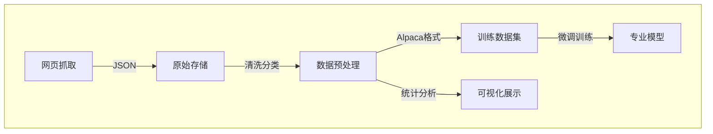

<h1 align='center'>DataScraping-LLMs-FineTuning</h1>

## 📋 概览

本项目旨在构建一个 **专业的医疗问答大模型**，通过对医疗问答数据的采集、处理和利用，最终实现基于 [**Qwen-7B-Chat**](https://github.com/QwenLM/Qwen?tab=readme-ov-file) 的医疗领域大模型微调。整个项目包含以下主要环节：

1. **数据采集**：异步爬虫技术高效抓取真实的医患问答数据，包括患者问题描述、医生专业解答以及对应科室分类信息。
2. **数据预处理**：进行数据清洗、质量筛选和格式转换，最终得到符合 **Alpaca 格式** 的训练数据集。
3. **数据可视化**：通过直观图表展示数据分布特征，辅助数据质量分析与评估。
4. **模型微调**：利用上述处理好的医疗问答数据，对 **Qwen-7B-Chat** 模型进行微调。该过程显著提升模型对患者问题的理解和生成专业回答的能力。
5. **模型测试及应用**：在推理阶段进行问答测试，为后续在医疗场景的广泛应用提供示例。

以下是数据可视化图表及整个项目流程。

<p align="center">
    
<p>
<br>



____


## 📂 文件结构

```
├── PreProcessing/          # 数据预处理模块
│   ├── format_converter.py # 数据格式转换工具
│   └── data_cleaner.py     # 数据清洗工具
├── Visualize/              # 数据可视化模块
│   └── visualizer.py       # 生成交互式图表
├── WebCrawler/             # 数据采集模块
│   ├── async_crawler.py    # 异步爬虫主逻辑
│   ├── crawler_config.py   # 爬虫配置文件
│   ├── LinkExtraction.py   # 链接抓取脚本
│   ├── main.py             # 详情页解析脚本
│   └── ua_info.py          # UA代理池
├── data/                   # 数据存储目录
│   ├── raw/                # 原始数据
│   ├── processed/          # 预处理后的数据
│   └── model/              # 模型训练数据
├── requirements.txt        # Python依赖列表
└── README.md               # 项目文档
```

------

## 🚀 快速开始

### 克隆项目

```bash
git clone https://github.com/zzz0627/DataScraping-LLMs-FineTuning.git
```

> **注**：此处默认读者已配置好 `Git`，若未安装可前往 [官网](https://git-scm.com/downloads) 安装（仅针对 Windows 用户，Linux 用户可直接通过命令行拉取）。
>
> 也可直接通过 [GitHub链接](https://github.com/zzz0627/DataScraping-LLMs-FineTuning) 下载本项目。

### 安装依赖

```bash
pip install -r requirements.txt
```

>  **注**：若你所在的环境网络访问国外资源缓慢，可考虑使用国内镜像源来安装依赖包.

------

**本项目可分为构建微调数据集、针对 Qwen-7B-Chat 进行微调两部分，下面逐一介绍。**

## 1. 数据集构建

### 1.1 配置爬虫

读者可先打开 `WebCrawler/crawler_config.py` 文件，根据个人需求和服务器配置调整以下参数：

```py
MAX_PROCESSES: int = 16      # 最大进程数
```

> **注**：以个人服务器为例，使用的CPU为`Intel(R) Xeon(R) Gold 6444Y, 32 CPU(s)`。此处可以设置为 32 ，达到最高的抓取速度，但需注意**不可对目标服务器造成过高的压力**，应根据目标网站的反爬策略和自身网络环境合理调整。在作者自测中，**8s** 能完成 **20000 条数据** 的信息解析（仅作参考）。

### 1.2 详情URL提取

配置好 `MAX_PROCESSES` 后，运行 `WebCrawler/LinkExtraction.py`，即可获取所有问答对的详情页 URL 列表：

```bash
cd WebCrawler/
python LinkExtraction.py
```

> **提示**：如运行该脚本速度较慢，可酌情分批执行或调整脚本中的等待时间。
>
> 已将抓取到的 20,000 条详情页 URL 置于 `data/raw/`，读者可跳过此步骤直接执行 `main.py`。

### 1.3 运行爬虫主程序

执行 `main.py` 脚本，会读取之前抓取到的 URL，对页面内容进行解析并提取原始问答对。结果文件存储在 `data/raw/` 路径下：

```sh
cd WebCrawler/
python main.py
```

### 1.4 数据预处理

#### 1.4.1 数据清洗与分类

此步骤将利用 [BERT](https://en.wikipedia.org/wiki/BERT_(language_model))进行初步的**语义分析**与**科室分类**。结果文件将保存在 `data/processed/`。在此阶段也可配置过滤逻辑，比如去除噪音数据或低质量回答。

```bash
cd PreProcessing/
python data_processor.py
```

> **注**：如果下载 Hugging Face 的模型速度较慢，可尝试国内镜像或手动下载放置到指定路径。

#### 1.4.2 数据格式化（转换为 Alpaca 格式）

此步骤将把清洗分类后的问答对数据转换为后续可直接用于 **Qwen-7B-Chat** 微调的 **Alpaca** 格式。生成文件将输出到 `data/model/`：

```bash
python format_converter.py
```

### 1.5 数据可视化

在 `Visualize/visualizer.py` 中完成可视化工作。脚本会读取 `data/processed/` 中的分类数据，并统计各科室的问答对数量，然后输出一个可交互的 HTML 图表，默认保存在 `data/processed/visualizations/` 目录下。

```bash
cd Visualize/
python visualizer.py
```

------

## 2. 大模型微调

本部分展示如何部署 [**Qwen-7B-Chat**](https://github.com/QwenLM/Qwen?tab=readme-ov-file) 模型并在此基础上进行医疗领域问答微调，同时兼顾**推理测试**环节。

> **注**：Qwen-7B-Chat 的完整推理或微调通常需要至少 16GB 显存，若进行完整训练或大批量推理，建议 24GB-32GB 以上。

### 2.1 安装 [flash-attention](https://github.com/Dao-AILab/flash-attention)

`flash_attention` 能够在大模型推理和训练时有效降低显存占用、提升速度。安装方式如下：

```bash
git clone https://github.com/Dao-AILab/flash-attention
cd flash-attention && pip install .
```

> **可选安装**：
>
> - 安装 csrc/layer_norm：`pip install csrc/layer_norm`
> - 若 flash-attn 版本 ≤ 2.1.1，也可安装 `csrc/rotary`：`pip install csrc/rotary`
> - 根据环境情况以及需求决定是否安装（安装过程可能耗时数分钟甚至十几分钟）。

### 2.2 模型的部署

1. **环境准备**：除了 `flash-attention`，还需安装类似 `transformers`、`accelerate`、`datasets` 等依赖，已在 `requirements.txt` 中列出。

2. **模型下载**：

   ```bash
   # 首先拉取项目文件 
   git clone https://github.com/QwenLM/Qwen.git
   
   cd Qwen/
   
   # 再通过命令行拉取模型文件
   pip install modelscope
   modelscope download --model Qwen/Qwen-7B-Chat
   ```

3. **模型试用**：

   此部分较为复杂，故用命令行表示。一步步操作即可。

   ```bash
   # 确保在项目文件夹下
   cd Qwen/
   
   # 此处用带 Web 界面的脚本作为演示
   vim web_demo.py
   
   # 找到 DEFAULT_CKPT_PATH 并修改
   # 鉴于已经将模型文件下载到当前目录下，直接改为Qwen-7B-Instruct即可
   DEFAULT_CKPT_PATH = 'Qwen-7B-Chat'
   
   # 修改完成后保存并退出
   python web_demo.py
   ```

   完成上述操作后，脚本会自动加载模型并提供一个Web页面。进入后可进行模型的试用和推理。	

### 2.3 微调流程

项目文件提供了`finetune.py`这个脚本供用户实现在自己的数据上进行微调的功能，以接入下游任务。

```bash
# 确保在项目文件夹下
cd Qwen/

# 此处以 LoRA 微调作为示例进行演示，若显存依旧不足可使用 QLoRA 进行量化后部署
vim finetune/finetune_lora_single_gpu.sh

# 需要在脚本中指定正确的模型路径和数据路径，模型默认输出文件夹不需要改动
# 只需修改两行内容，修改如下
MODEL="Qwen-7B-Chat"
DATA="/path/to/alpaca_medical_qa_xxx.json"

# 保存后退出
# 可直接运行微调脚本进行训练
python finetune.py
```

> **注**：由于Hugging Face的内部实现，模型在保存时，一些文件将不会被保存，如后续提示关于文件不存在信息，请手动复制有关文件。

### 2.4 推理与测试

训练完成后，权重将保存在`output_qwen/`。对微调后的模型验证训练效果并进行推理测试非常重要。可使用如下代码读取模型：

```python
from peft import AutoPeftModelForCausalLM

model = AutoPeftModelForCausalLM.from_pretrained(
    path_to_adapter, # path to the output directory
    device_map="auto",
    trust_remote_code=True
).eval()
```

读者仅需在命令行中进行如下操作：

```bash
# 确保在项目文件夹下
cd Qwen/

# 复制一份文件用于测试微调后的模型
cp web_demo.py web_demo_tuned.py
vim web_demo_tuned.py

# 找到 DEFAULT_CKPT_PATH 并修改
# 此时首先需要在脚本头部导入
from peft import AutoPeftModelForCausalLM
# 并将目录改成权重输出的目录
DEFAULT_CKPT_PATH = 'output_qwen'

# 需要注意的是，model加载代码需要替换
# 将原本的代码进行修改使用导入后的方法
# AutoPeftModelForCausalLM.from_pretrained() 这个方法会自动加载原模型的权重，同时也会利用微调后的模型权重
    model = AutoPeftModelForCausalLM.from_pretrained(
    args.checkpoint_path,
    device_map="auto",
    trust_remote_code=True
    ).eval()

# 修改完成后保存并退出即可
```

完成上述操作后，直接运行测试微调后模型的脚本：

```bash
python web_demo_tuned.py
```

通过简单的试用后不难发现模型针对医疗问题的推理能力有显著提升

> 注：此处运行脚本很有可能提示xxx文件找不到，此时需要手动复制`Qwen-7B-Chat/`目录下的同名文件到`output_qwen/`目录中。

------

## 3. 常见问题 (FAQ)

1. **Q**：若在加载 Qwen-7B-Chat 模型时出现显存不足怎么办？
    **A**：建议使用 [LoRA](https://github.com/microsoft/LoRA) 或 8-bit 量化方法（如 [bitsandbytes](https://github.com/TimDettmers/bitsandbytes)）。此外，可考虑在多 GPU 环境下分布式加载。
2. **Q**：数据质量如何把控？
    **A**：在 `data_cleaner.py` 中可自定义过滤逻辑，比如去除过短回答、过长噪音等文本。也可在数据可视化阶段检查科室分布，尽量保证均衡。
3. **Q**：模型训练好后，如何保证在实际问答中保持专业性与安全性？
    **A**：建议在推理后加入规则模块或审查模块进行二次过滤。同时，对于医疗领域模型应在输出末尾加入免责声明，如“本回答仅供参考，不能替代医生诊断。”
4. **Q**：Flash Attention 是否必须安装？
    **A**：不是必需，但强烈建议安装，以提高大模型训练和推理效率并降低显存占用。

------

## 4. 贡献指南

非常欢迎你对本项目进行任何形式的贡献，包括但不限于：新增功能、优化代码、修复 Bug、完善文档等。具体流程如下：

1. **Fork 本仓库**：将项目复制到你的 GitHub 账户下。
2. **创建新分支**：`git checkout -b feature/your-feature`。
3. **提交代码**：`git commit -am 'Add new feature'`。
4. **推送到分支**：`git push origin feature/your-feature`。
5. **提交 Pull Request**：描述你的修改内容并发起合并请求。

------

## 5. 许可证

本项目使用 [MIT License](https://github.com/zzz0627/DataScraping-LLMs-FineTuning/blob/main/LICENSE) 进行开源。你可以自由复制、修改和分发本项目的代码，但需保留本项目的版权和许可信息。

------

## 6. 联系方式

如果你在项目使用过程中有任何疑问或想法，欢迎通过以下方式与我们联系：

- **GitHub Issues**: [项目问题讨论区](https://github.com/zzz0627/DataScraping-LLMs-FineTuning/issues)
- **Email**: [z55120621@gmail.com](mailto:z55120621@gmail.com)

------

## 7. 声明

- 本项目仅供研究与学习使用，**不作为任何医疗诊断或治疗依据**。
- 在使用本项目的数据或模型推断结果时，仍需结合专业医学知识或就医咨询。
- 若本项目中引用了你的数据而未经授权，请及时联系我们进行删除或声明。

------

**祝你在大模型的探索之路上一切顺利！若你觉得本项目对你有帮助，欢迎 Star 和 Fork！**
